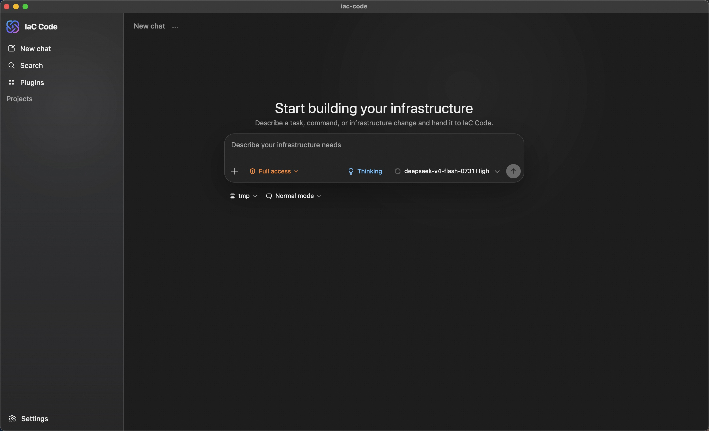
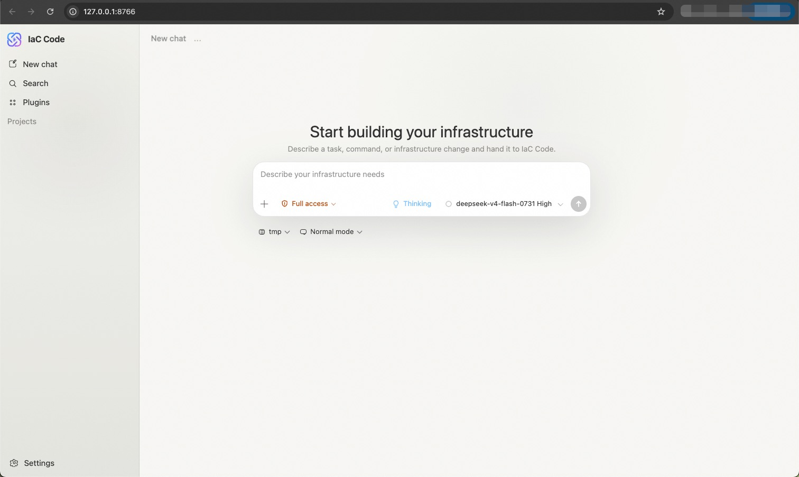

<p align="center">
  
</p>
<p align="center">
  <em>Asistente de Infraestructura como Código (IaC) impulsado por IA que genera y gestiona plantillas de infraestructura cloud mediante interacción en lenguaje natural. Actualmente admite flujos de trabajo de Alibaba Cloud ROS y Terraform.</em>
</p>
<p align="center">
  <a href="https://github.com/aliyun/iac-code/actions/workflows/test.yml"></a>
  <a href="https://pypi.org/project/iac-code"></a>
  <a href="https://pypi.org/project/iac-code"></a>
</p>
<p align="center">
  <strong>Language</strong>: <a href="../README.md">English</a> | <a href="README.zh.md">中文</a> | Español | <a href="README.fr.md">Français</a> | <a href="README.de.md">Deutsch</a> | <a href="README.ja.md">日本語</a> | <a href="README.pt.md">Português</a>
</p>

> **Documentación**: [https://aliyun.github.io/iac-code/](https://aliyun.github.io/iac-code/es/)

<p align="center">
  <a href="https://github.com/aliyun/iac-code/releases/latest"></a>
  <br>
  <a href="https://ros-public-tools.oss-cn-beijing.aliyuncs.com/github-releases/aliyun/iac-code/desktop/stable/iac-code-macos-arm64.dmg">macOS Apple Silicon</a> ·
  <a href="https://ros-public-tools.oss-cn-beijing.aliyuncs.com/github-releases/aliyun/iac-code/desktop/stable/iac-code-windows-x64.exe">Windows x64</a> ·
  <a href="https://ros-public-tools.oss-cn-beijing.aliyuncs.com/github-releases/aliyun/iac-code/desktop/stable/iac-code-linux-x64.AppImage">Linux AppImage</a> ·
  <a href="https://ros-public-tools.oss-cn-beijing.aliyuncs.com/github-releases/aliyun/iac-code/desktop/stable/iac-code-linux-x64.deb">Linux deb</a> ·
  <a href="https://github.com/aliyun/iac-code/releases/latest">Todos los archivos de la versión</a>
</p>

## Aplicación de escritorio

Sin necesidad de Python, pip ni configuración de terminal: descarga la app nativa y empieza a construir infraestructura cloud de inmediato.

Para usar IaC Code como una aplicación nativa, descarga el paquete de tu plataforma desde la [última versión de GitHub](https://github.com/aliyun/iac-code/releases/latest):

- macOS con Apple Silicon: `.dmg`
- Windows x64: instalador `.exe`
- Linux x64: `.AppImage` o `.deb`

La aplicación de escritorio ejecuta el mismo motor de IaC Code y comparte proveedores, credenciales de nube, ajustes, proyectos y sesiones con la CLI y la aplicación web. En el primer inicio, selecciona la carpeta del proyecto en la que trabajará IaC Code. En Windows también se comprueba si Git Bash está instalado y, si falta, se ofrece una guía de instalación.

<p align="center">
  
</p>

Las versiones para macOS, Windows y AppImage pueden buscar e instalar desde la aplicación actualizaciones firmadas criptográficamente. El paquete deb se actualiza instalando una versión más reciente. Los paquetes estables de macOS están firmados con Apple Developer ID y notarizados por Apple; los paquetes estables de Windows llevan una firma de editor Authenticode. Descarga siempre desde la página oficial de la versión y comprueba el archivo `SHA256SUMS` publicado con ella. Consulta la [guía de la aplicación de escritorio](https://aliyun.github.io/iac-code/es/docs/desktop-app) para obtener instrucciones y resolver problemas.

## Instalación

La CLI y la aplicación web siguientes funcionan con Python 3.10 o posterior, en macOS, Linux y Windows. Si solo usas la app de escritorio, puedes omitir esta sección.

> **Nota de Windows**: En Windows, se debe instalar [Git for Windows](https://gitforwindows.org/) para proporcionar el entorno de shell bash utilizado por la ejecución de herramientas. Si Git Bash está instalado pero no se encuentra en el PATH, configure la variable de entorno `IAC_CODE_GIT_BASH_PATH`. Si aún no está instalado, ejecuta `iac-code install-git-bash` para instalar Git for Windows automáticamente (descargado a través del espejo npmmirror).

```bash
pip install iac-code
```

## Uso

En el primer uso, configure el proveedor de LLM y el servicio en la nube de IaC ingresando `/auth` en el modo interactivo.

### Modo Interactivo

Ejecute directamente para ingresar al REPL interactivo:

```bash
iac-code
```

<p align="center">
  
</p>

### Modo No Interactivo

Pase un prompt único mediante `--prompt`:

```bash
iac-code --prompt "Crear un VPC y dos instancias ECS"
```

También se admite la lectura desde stdin:

```bash
echo "Crear un bucket OSS" | iac-code --prompt -
```

### Aplicación web

¿Prefieres una interfaz gráfica? Inicia la aplicación web local, que ejecuta el mismo motor que la CLI y comparte las mismas sesiones. La aplicación web necesita el extra `http`, así que instálalo primero:

```bash
pip install 'iac-code[http]'
iac-code web
```

De forma predeterminada, abre `http://127.0.0.1:8766` en tu navegador (solo bucle invertido). Consulta la [guía de la aplicación web](https://aliyun.github.io/iac-code/es/web-app) para más detalles.

<p align="center">
  
</p>

### Agent Skill

Añade IaC Code a un agente compatible para diseñar arquitecturas cloud, trabajar con plantillas ROS o Terraform, estimar costes, gestionar stacks y desplegar recursos de Alibaba Cloud desde la conversación. Descarga el [último Skill estable](https://ros-public-tools.oss-cn-beijing.aliyuncs.com/github-releases/aliyun/iac-code/skill/stable/iac-code-skill.zip) o compara las distribuciones en la [visión general de los Skills oficiales](https://aliyun.github.io/iac-code/es/docs/a2a/skill-overview).

## Contribuir

Instale [uv](https://docs.astral.sh/uv/getting-started/installation/), luego:

```bash
make install   # instalar dependencias y hooks de pre-commit
make dev       # ejecutar en modo depuración
make test      # ejecutar pruebas
make lint      # ejecutar linters
make format    # formatear código
```

Consulte la [Guía de contribución](https://aliyun.github.io/iac-code/es/getting-started/contributing) para más detalles.

## Contáctenos

| [DingTalk](https://qr.dingtalk.com/action/joingroup?code=v1,k1,ubm/77U7qRh/STFZUNBP26X4PNg2z6+uhiPcLGtDNfU=&_dt_no_comment=1&origin=11) | [Discord](https://discord.gg/qECFuFBwF) |
| :----------------------------------------------------------: | :----------------------------------------------------------: |
| [](https://qr.dingtalk.com/action/joingroup?code=v1,k1,ubm/77U7qRh/STFZUNBP26X4PNg2z6+uhiPcLGtDNfU=&_dt_no_comment=1&origin=11) | [](https://discord.gg/qECFuFBwF) |
