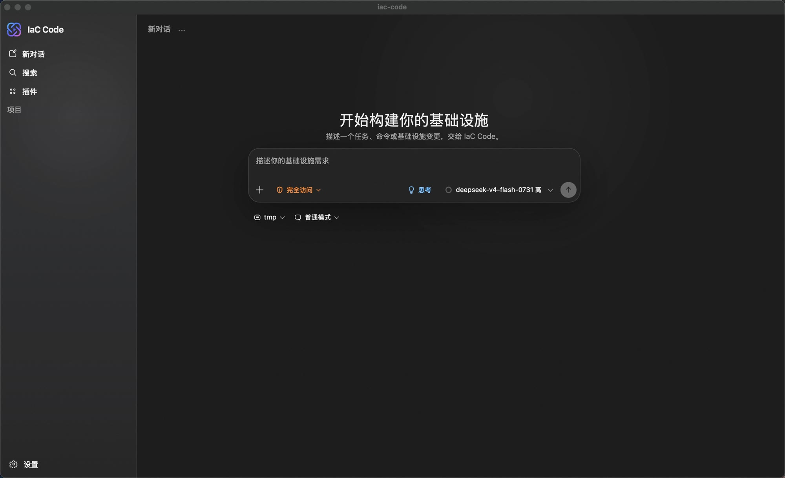
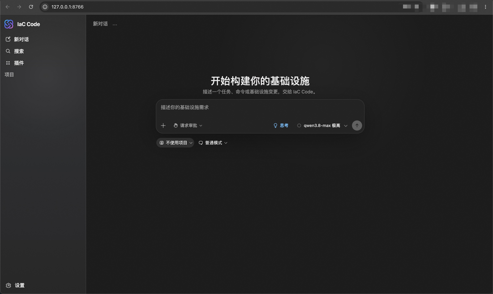

<p align="center">
  
</p>
<p align="center">
  <em>面向云基础设施的 AI 基础设施即代码助手，通过自然语言交互生成和管理基础设施模板。目前支持阿里云 ROS 与 Terraform 工作流。</em>
</p>
<p align="center">
  <a href="https://github.com/aliyun/iac-code/actions/workflows/test.yml"></a>
  <a href="https://pypi.org/project/iac-code"></a>
  <a href="https://pypi.org/project/iac-code"></a>
</p>
<p align="center">
  <strong>Language</strong>: <a href="../README.md">English</a> | 中文 | <a href="README.es.md">Español</a> | <a href="README.fr.md">Français</a> | <a href="README.de.md">Deutsch</a> | <a href="README.ja.md">日本語</a> | <a href="README.pt.md">Português</a>
</p>

> **文档**：[https://aliyun.github.io/iac-code/](https://aliyun.github.io/iac-code/zh-Hans/)

<p align="center">
  <a href="https://github.com/aliyun/iac-code/releases/latest"></a>
  <br>
  <a href="https://ros-public-tools.oss-cn-beijing.aliyuncs.com/github-releases/aliyun/iac-code/desktop/stable/iac-code-macos-arm64.dmg">macOS Apple 芯片</a> ·
  <a href="https://ros-public-tools.oss-cn-beijing.aliyuncs.com/github-releases/aliyun/iac-code/desktop/stable/iac-code-windows-x64.exe">Windows x64</a> ·
  <a href="https://ros-public-tools.oss-cn-beijing.aliyuncs.com/github-releases/aliyun/iac-code/desktop/stable/iac-code-linux-x64.AppImage">Linux AppImage</a> ·
  <a href="https://ros-public-tools.oss-cn-beijing.aliyuncs.com/github-releases/aliyun/iac-code/desktop/stable/iac-code-linux-x64.deb">Linux deb</a> ·
  <a href="https://github.com/aliyun/iac-code/releases/latest">全部发布文件</a>
</p>

## 桌面应用

无需 Python、pip 或终端配置——下载原生应用，立即开始构建云基础设施。

如需原生桌面体验，请从 [GitHub 最新正式版本](https://github.com/aliyun/iac-code/releases/latest) 下载对应平台的安装包：

- macOS Apple 芯片：`.dmg`
- Windows x64：`.exe` 安装程序
- Linux x64：`.AppImage` 或 `.deb`

桌面应用运行与 CLI 和 Web 应用相同的 IaC Code 引擎，并共用模型服务、云凭证、设置、项目和会话。首次启动时，请选择希望 IaC Code 操作的项目目录。Windows 版还会检查 Git Bash；如果尚未安装，应用会提供安装引导。

<p align="center">
  
</p>

macOS、Windows 和 AppImage 版本可在应用内检查并安装经过加密签名的更新；deb 版本需要安装新版软件包来更新。稳定版 macOS 安装包使用 Apple Developer ID 签名并经过 Apple 公证，稳定版 Windows 安装包带有 Authenticode 发布者签名。请始终从官方版本页面下载，并核对随版本发布的 `SHA256SUMS`。安装方法和故障排查详见[桌面应用指南](https://aliyun.github.io/iac-code/zh-Hans/docs/desktop-app)。

## 安装

下面的 CLI 与 Web 应用运行在 Python 3.10 或更高版本上，支持 macOS、Linux 和 Windows。如果只使用桌面应用，可跳过本节。

> **Windows 说明**：在 Windows 上需要安装 [Git for Windows](https://gitforwindows.org/) 以提供工具执行所需的 bash 环境。如果 Git Bash 已安装但不在 PATH 中，请设置 `IAC_CODE_GIT_BASH_PATH` 环境变量。如果尚未安装，可运行 `iac-code install-git-bash` 自动安装 Git for Windows（经 npmmirror 镜像下载）。

```bash
pip install iac-code
```

## 使用

首次使用需要先配置 LLM 提供商和 IaC 云服务，在交互模式中输入 `/auth` 完成配置。

### 交互模式

直接运行进入交互式 REPL：

```bash
iac-code
```

<p align="center">
  
</p>

### 非交互模式

通过 `--prompt` 传入单次提示：

```bash
iac-code --prompt "创建一个 VPC 和两台 ECS 实例"
```

也支持从 stdin 读取输入：

```bash
echo "创建一个 OSS Bucket" | iac-code --prompt -
```

### Web 应用

更喜欢图形界面？可以启动本地 Web 应用，它运行与 CLI 相同的引擎，并共享同一份会话。Web 应用需要 `http` 扩展，请先安装：

```bash
pip install 'iac-code[http]'
iac-code web
```

默认会在浏览器中打开 `http://127.0.0.1:8766`（仅限回环地址）。详见 [Web 应用指南](https://aliyun.github.io/iac-code/zh-Hans/web-app)。

<p align="center">
  
</p>

### Agent Skill

将 IaC Code 添加到兼容的 Agent，即可在对话中规划云架构、处理 ROS 或 Terraform 模板、估算费用、操作资源栈并部署阿里云资源。下载[最新稳定版 Skill](https://ros-public-tools.oss-cn-beijing.aliyuncs.com/github-releases/aliyun/iac-code/skill/stable/iac-code-skill.zip)，或通过 [IaC Code 官方 Skills 概览](https://aliyun.github.io/iac-code/zh-Hans/docs/a2a/skill-overview)对比不同发行版。

## 贡献

安装 [uv](https://docs.astral.sh/uv/getting-started/installation/)，然后：

```bash
make install   # 安装依赖和 pre-commit 钩子
make dev       # 以调试模式运行
make test      # 运行测试
make lint      # 运行代码检查
make format    # 格式化代码
```

详见[贡献指南](https://aliyun.github.io/iac-code/zh-Hans/getting-started/contributing)。

## 联系我们

| [钉钉](https://qr.dingtalk.com/action/joingroup?code=v1,k1,ubm/77U7qRh/STFZUNBP26X4PNg2z6+uhiPcLGtDNfU=&_dt_no_comment=1&origin=11) | [Discord](https://discord.gg/qECFuFBwF) |
| :----------------------------------------------------------: | :----------------------------------------------------------: |
| [](https://qr.dingtalk.com/action/joingroup?code=v1,k1,ubm/77U7qRh/STFZUNBP26X4PNg2z6+uhiPcLGtDNfU=&_dt_no_comment=1&origin=11) | [](https://discord.gg/qECFuFBwF) |
